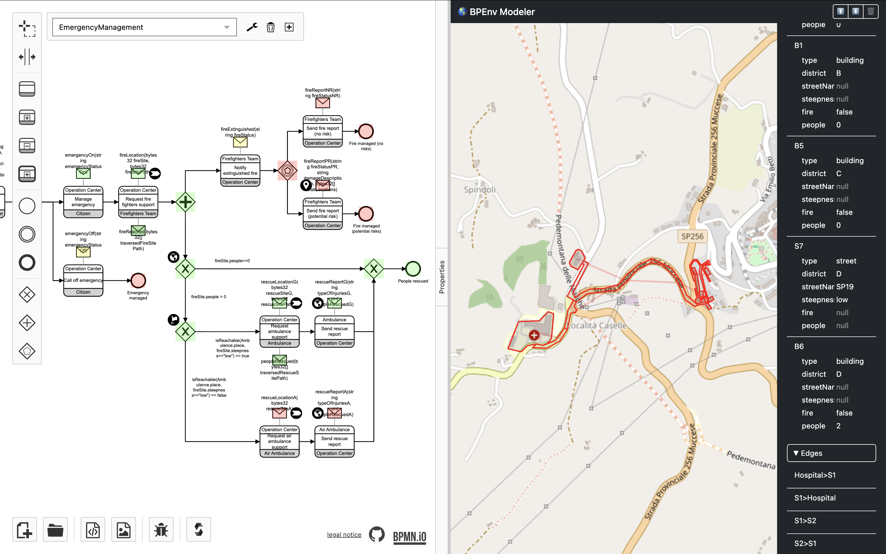

# EnvChain

EnvChain is a blockchain-based tool for modeling and enacting Environment-aware BPMN Choreographies.



## Setup

1. **Install Node.js**: 
    
    Ensure that Node.js is installed on your system. You can download it from [https://nodejs.org/](https://nodejs.org/).

2. **Install dependencies**:
   
   ```bash
   npm install

3. **Frontend**:  
   
   Navigate to the frontend directory and start the development server:  
   ```bash
   npm run dev

4. **Backend**:

    Navigate to the backend directory and start the backend service:

    ```
    npm run backend
    ```

5.	**MetaMask**:

    Install the MetaMask browser extension and authenticate with a wallet. This is necessary to interact with the blockchain.

## Updating the Environment Model

EnvChain allows updating the spatial environment model stored in the env.sol contract, simulating external agents that modify the environment.

To update the environment model:
1.	Set the following environment variables in `app_backend/.env` (use a testnet and do not use a real private key):

    RPC_URL=YOUR_RPC_URL

    PRIVATE_KEY=YOUR_PRIVATE_KEY


2.	Run the update script:

    ```
    npm run update_env
    ```

This will push the updated environment data from ```updated_env.json``` to the deployed ```env.sol``` contract, simulating external changes to the model.